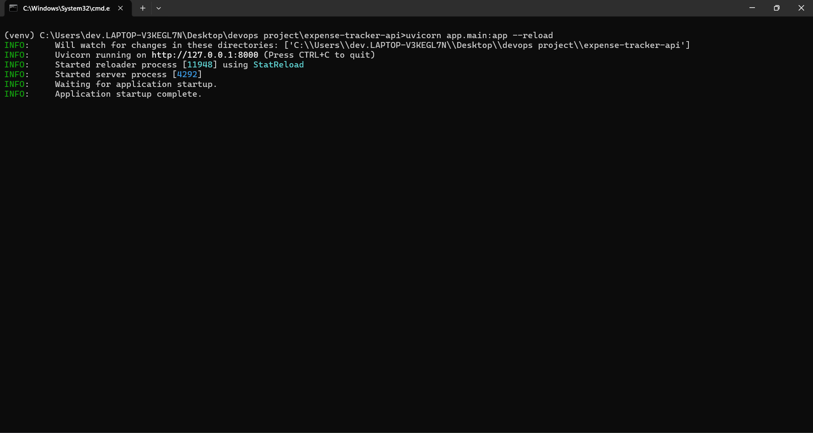
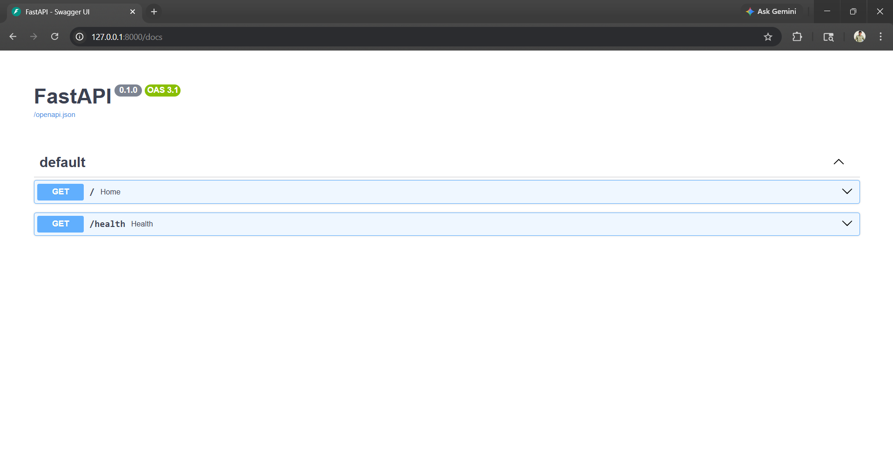
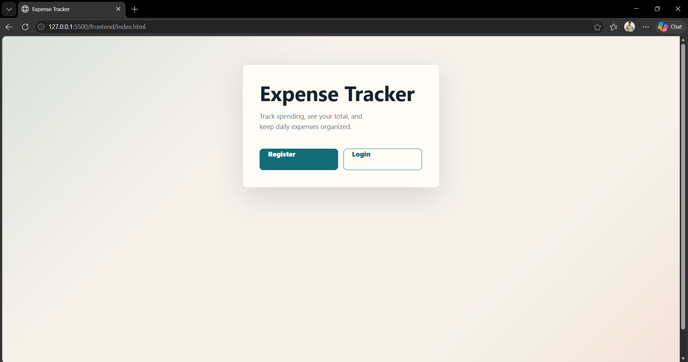
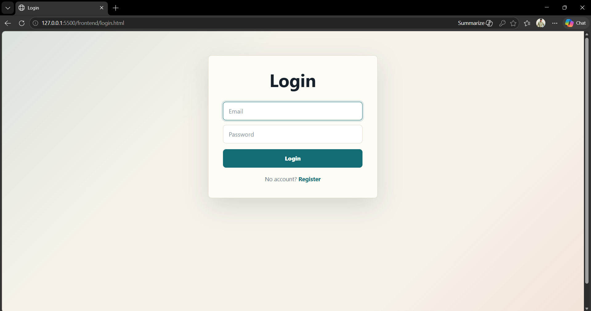
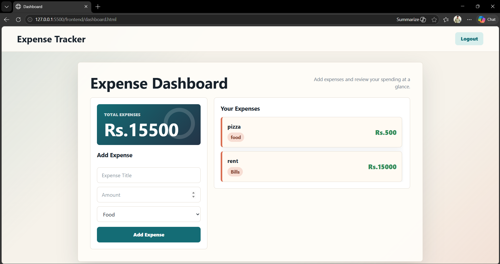
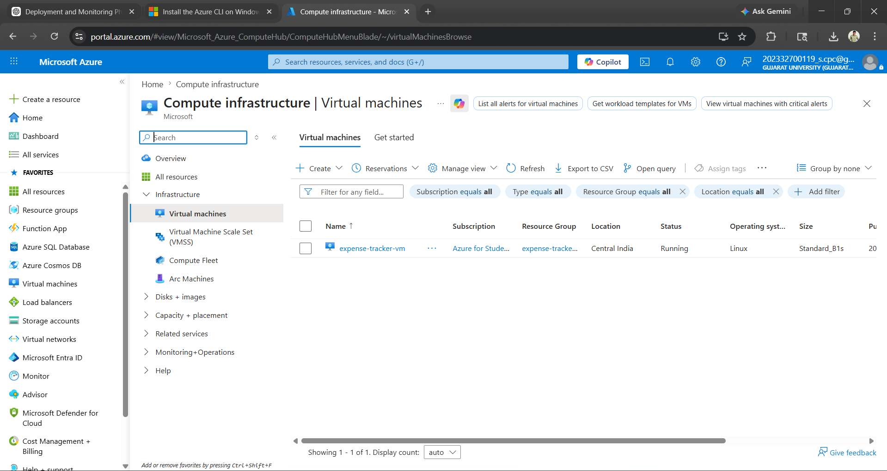
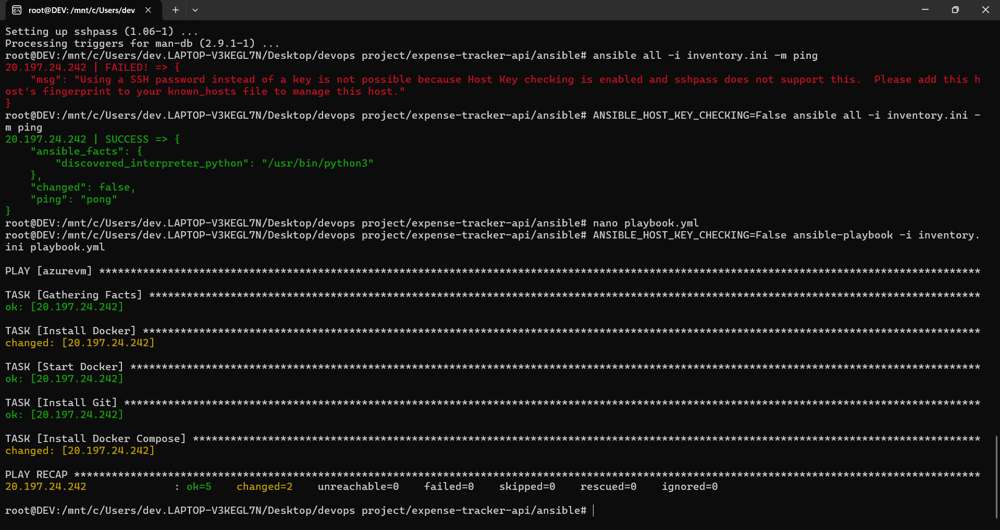

# Expense Tracker DevOps Project

## Project Overview

This project is a complete end-to-end DevOps implementation of an Expense Tracker web application using FastAPI, Docker, Terraform, Azure, Ansible, Prometheus, and Grafana.

The project demonstrates:

- Full Stack Application Development
- Containerization using Docker
- CI/CD using GitHub Actions
- Infrastructure as Code (IaC) using Terraform
- Cloud Deployment on Azure VM
- Configuration Management using Ansible
- Monitoring using Prometheus & Grafana
- Automated Deployment Workflow

---

# Tech Stack Used

## Backend
- FastAPI
- Python
- SQLite
- SQLAlchemy
- JWT Authentication
- Uvicorn

## Frontend
- HTML
- CSS
- JavaScript

## DevOps Tools
- Docker
- Docker Compose
- Git & GitHub
- GitHub Actions
- Terraform
- Azure VM
- Azure CLI
- Ansible
- WSL Ubuntu
- Prometheus
- Grafana
- Node Exporter

---

# Project Architecture

```text
User
   ↓
Azure VM
   ↓
Docker Containers
├── FastAPI Application
├── Prometheus
└── Grafana
   ↓
Node Exporter
```

---

# Features

## Backend Features
- User Registration
- User Login
- JWT Authentication
- Protected Routes
- Create Expense API
- Get Expenses API
- Health Check Endpoint
- Swagger API Documentation

## Frontend Features
- User Registration UI
- Login UI
- Dashboard UI
- Expense Management
- Dynamic Expense Loading
- Responsive Design

## DevOps Features
- Dockerized Application
- Automated CI/CD Pipeline
- Infrastructure Provisioning with Terraform
- Automated Deployment with Ansible
- Monitoring with Prometheus & Grafana

---

# Screenshots

## Backend

### FastAPI Running


### Swagger Docs


---

## Frontend

### Homepage UI


### Login Page


### Dashboard


---

## Docker

### Docker Containers


---

## Terraform

### Terraform Apply


### Azure VM


---

## Ansible

### Ansible Playbook Success


---

## Monitoring

### Node Exporter Metrics


### Prometheus Targets


### Grafana Dashboard


---

# CI/CD Workflow

```text
GitHub Push
    ↓
GitHub Actions
    ↓
Docker Build
    ↓
Azure VM Deployment
    ↓
Ansible Automation
    ↓
Docker Compose Deployment
```

---

# Monitoring Stack

## Prometheus
- Metrics Collection
- Target Monitoring
- Scraping Node Exporter Metrics

## Grafana
- Monitoring Dashboards
- CPU Monitoring
- Memory Monitoring
- Basic Alerting Workflow

## Node Exporter
- CPU Metrics
- RAM Metrics
- Disk Metrics
- Network Metrics

---

# Commands Used

## Terraform

```bash
terraform init
terraform plan
terraform apply
```

## Docker

```bash
docker build -t expense-tracker-app .
docker-compose up --build -d
```

## Ansible

```bash
ansible-playbook -i inventory.ini deploy.yml
ansible-playbook -i inventory.ini monitoring.yml
```

---

# Future Improvements

- PostgreSQL Integration
- HTTPS with Nginx
- Kubernetes Deployment

---

# Project Status

✅ Full Stack Application Completed

✅ Dockerized Application

✅ CI/CD Pipeline Configured

✅ Terraform Infrastructure Created

✅ Azure VM Deployment Completed

✅ Ansible Deployment Automated

✅ Monitoring Stack Configured

✅ Prometheus & Grafana Working

✅ End-to-End DevOps Workflow Completed

---

# Author

DEV PATEL
